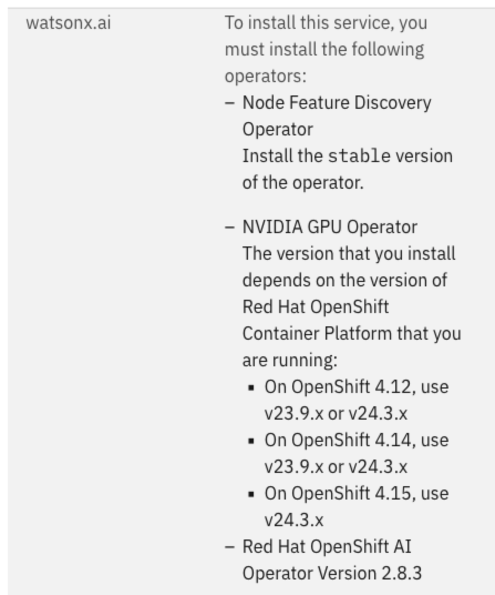
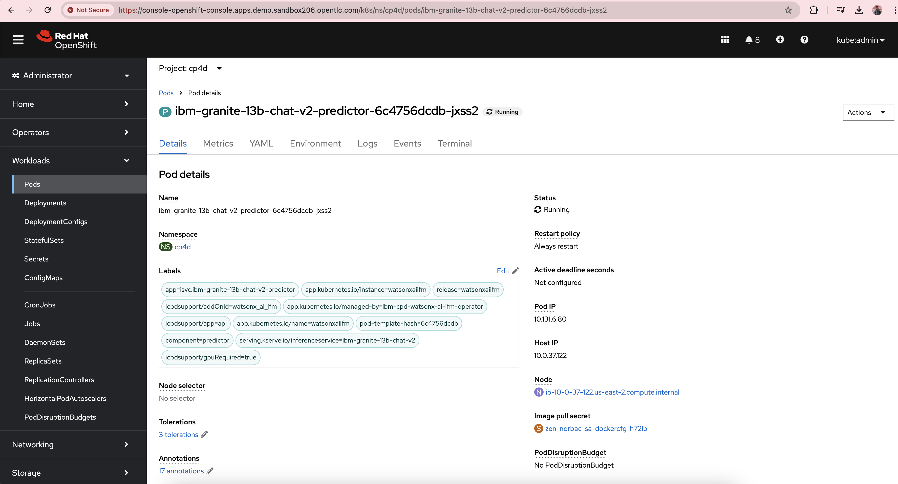

# Installation of Watsonx.ai on OpenShift

This guide provides instructions for a quick PoC kind of installation of Watsonx.ai on OpenShift. 
Watsonx.ai can be installed on top of OpenShift either in public cloud or on-prem.

## Installation Steps
### Installing Cloud Pak for Data Control Plane

1. Have a running OCP cluster.
   I had 6 worker nodes (m6i.2xlarge) running on AWS of which I allocated 3 nodes for OpenShift Data Foundation(ODF). I installed ODF using Operator Hub on the OpenShift web interface.  

2.    

  	From Operator hub from OpenShift web interface, install Node Feature Discovery operator. Then create an instance of Node feature discovery       
      Then, from Operator hub from OpenShift web interface, install NVIDIA GPU Operator. Then create an instance of Cluster Policy 

   Then, from Operator hub from OpenShift web interface, install OpenShift AI Operator. Please follow instructions listed in https://docs.redhat.com/en/documentation/red_hat_openshift_ai_self-managed/2.8/html/installing_and_uninstalling_openshift_ai_self-managed/preparing-openshift-ai-for-ibm-cpd_prepare-openshift-ai-ibm-cpd#preparing-openshift-ai-for-ibm-cpd_prepare-openshift-ai-ibm-cpd  
	I made 4 changes in  inferenceservice-config in redhat-ods-applications namespace  

        enableDirectPvcVolumeMount  -> changed it from false to true 
        ingressClassName -> changed it from istio to openshift-default 
        changed "domainTemplate": "{{ .Name }}-{{ .Namespace }}.{{ .IngressDomain }} to "domainTemplate": "example.com"
        Added annotation    
           opendatahub.io/managed: 'false' 
    

        
3. Have Podman or docker desktop up and running on your workstation - to pull images from IBM’s registry

4. Install Cloud Pak for Data command-line interface  cpd-cli command line client  on your workstation
  https://www.ibm.com/docs/en/cloud-paks/cp-data/5.0.x?topic=workstation-installing-cloud-pak-data-cli

5. Create an environment variable file  
  https://www.ibm.com/docs/en/cloud-paks/cp-data/5.0.x?topic=information-setting-up-installation-environment-variables and source it
     [Sample environment variables file ](cpd_vars.sh) .
       
 6. Login to the OCP cluster using cpd-cli
    
        cpd-cli manage login-to-ocp --username=${OCP_USERNAME} --password=${OCP_PASSWORD} --server=${OCP_URL}
        
 7. Get IBM entitlement key by logging into https://myibm.ibm.com/products-services/containerlibrary
    https://www.ibm.com/docs/en/cloud-paks/cp-data/5.0.x?topic=information-obtaining-your-entitlement-api-key

    Then update the global pull secret 
    https://www.ibm.com/docs/en/cloud-paks/cp-data/5.0.x?topic=cluster-updating-global-image-pull-secret command	

        cpd-cli manage add-icr-cred-to-global-pull-secret \
        --entitled_registry_key=${IBM_ENTITLEMENT_KEY}

 8.  Create 2 namespaces in OpenShift (cpd-operators, cp4d)
     Which you assigned in the environment variable file
        PROJECT_CPD_INST_OPERATORS=cpd-operators
        PROJECT_CPD_INST_OPERANDS=cp4d

 9. Before you install an instance of IBM Cloud Pak for Data, you must ensure that the project where the operators will be installed can watch the project where the Cloud Pak for Data control plane and services are installed.

https://www.ibm.com/docs/en/cloud-paks/cp-data/5.0.x?topic=data-applying-required-permissions-projects-namespaces#taskprep-for-cpd-project-permissions__steps

        cpd-cli manage authorize-instance-topology \
        --cpd_operator_ns=${PROJECT_CPD_INST_OPERATORS} \
        --cpd_instance_ns=${PROJECT_CPD_INST_OPERANDS}

10. Before you install IBM Cloud Pak for Data, you must install the IBM Cloud Pak foundational services Certificate manager and License Service.
    
    https://www.ibm.com/docs/en/cloud-paks/cp-data/5.0.x?topic=cluster-installing-shared-components#taskshared-components__steps__1

        cpd-cli manage apply-cluster-components \
        --release=${VERSION} \
        --license_acceptance=true \
        --cert_manager_ns=${PROJECT_CERT_MANAGER} \
        --licensing_ns=${PROJECT_LICENSE_SERVICE}
11. Run the cpd-cli manage setup-instance-topology to install IBM Cloud Pak foundational services and create the required ConfigMap: without tethered projects
    
    https://www.ibm.com/docs/en/cloud-paks/cp-data/5.0.x?topic=data-installing-cloud-pak-foundational-services

        cpd-cli manage setup-instance-topology \
        --release=${VERSION} \
        --cpd_operator_ns=${PROJECT_CPD_INST_OPERATORS} \
        --cpd_instance_ns=${PROJECT_CPD_INST_OPERANDS} \
        --license_acceptance=true \
        --block_storage_class=${STG_CLASS_BLOCK}
12. Review the license for CP4D
    
    https://www.ibm.com/docs/en/cloud-paks/cp-data/5.0.x?topic=data-installing-cloud-pak#taskinstall-platform-instance__steps__1 step 2

        cpd-cli manage get-license \
        --release=5.0.0 \
        --license-type=SE

13. Install the operators in the operators project for the instance for Cloud Pak for Data Platform Operator only 
    https://www.ibm.com/docs/en/cloud-paks/cp-data/5.0.x?topic=data-installing-cloud-pak#taskinstall-platform-instance__steps__1 step 3

        cpd-cli manage apply-olm \
        --release=${VERSION} \
        --cpd_operator_ns=${PROJECT_CPD_INST_OPERATORS} \
        --components=cpd_platform

14. Install the operands in the operands project for the instance:
    
    https://www.ibm.com/docs/en/cloud-paks/cp-data/5.0.x?topic=data-installing-cloud-pak#taskinstall-platform-instance__steps__1 step 4
    For OpenShift Data Foundation storage, to install Cloud Pak for Data control plane only

        cpd-cli manage apply-cr \
        --release=${VERSION} \
        --cpd_instance_ns=${PROJECT_CPD_INST_OPERANDS} \
        --components=cpd_platform \
        --block_storage_class=${STG_CLASS_BLOCK} \
        --file_storage_class=${STG_CLASS_FILE} \
        --license_acceptance=true

15. Get the Cloud Pak for data web interface url and credentials
    
    https://www.ibm.com/docs/en/cloud-paks/cp-data/5.0.x?topic=data-installing-cloud-pak#taskinstall-platform-instance__steps__1 step 6

        cpd-cli manage get-cpd-instance-details \
        --cpd_instance_ns=${PROJECT_CPD_INST_OPERANDS} \
        --get_admin_initial_credentials=true

### Installing Watsonx.ai service on top of Cloud Pak for Data 

16. Run the following command to create the required OLM objects for IBM watsonx.ai in the operators project for the instance:
	https://www.ibm.com/docs/en/cloud-paks/cp-data/5.0.x?topic=watsonxai-installing#cli-install__procedure__title__1 Step 2
 
         cpd-cli manage apply-olm \
         --release=${VERSION} \
         --cpd_operator_ns=${PROJECT_CPD_INST_OPERATORS} \
         --components=watsonx_ai

  17. Create the custom resource for IBM watsonx.ai
      https://www.ibm.com/docs/en/cloud-paks/cp-data/5.0.x?topic=watsonxai-installing#cli-install__procedure__title__1 step 3
      The OpenShift Data Foundation storage specific command being

            cpd-cli manage apply-cr \
            --components=watsonx_ai \
            --release=${VERSION} \
            --cpd_instance_ns=${PROJECT_CPD_INST_OPERANDS} \
            --block_storage_class=${STG_CLASS_BLOCK} \
            --file_storage_class=${STG_CLASS_FILE} \
            --license_acceptance=true

      Monitor the PROJECT_CPD_INST_OPERANDS namespace(cp4d in the case of the attached env variables file) for an errors.
      
   18. Validate the installation  

             cpd-cli manage get-cr-status --cpd_instance_ns=${PROJECT_CPD_INST_OPERANDS}

   19. As I wanted to install  meta-llama-llama-2-13b-chat foundational model, I added an extra OpenShift worker node of g5.8xlarge type on AWS.  
     https://www.ibm.com/docs/en/cloud-paks/cp-data/5.0.x?topic=setup-adding-ai-models
     has the list of foundational models.  Please check the resource requirements list.  Note: If you want to install multiple models, it will need quite a lot of memory, cpu, gpus.

   20.  Add the desired foundation models  
        

               oc patch watsonxaiifm watsonxaiifm-cr \
               --namespace=${PROJECT_CPD_INST_OPERANDS} \
               --type=merge \
               --patch='{"spec":{"install_model_list": ["ibm-granite-13b-chat-v2"]}}'

	       

 

### Troubleshooting the installation

If foundational model is not being added, searching for InferenceService custom resource, checking its events in PROJECT_CPD_INST_OPERANDS namespace is a good idea  

If in CPD5.0, foundational model is not getting added, checking the kserve-controller-manager-xxxxx pod logs in redhat-ods-applications namespace is another troubleshooting option

